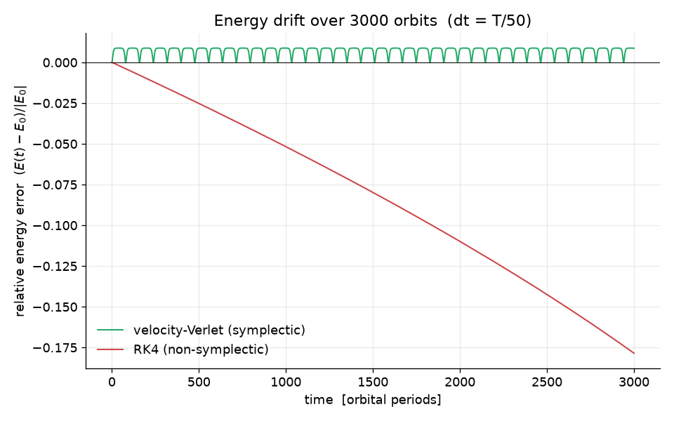
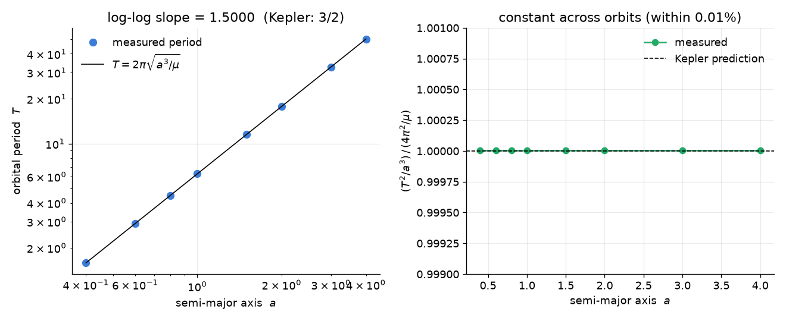
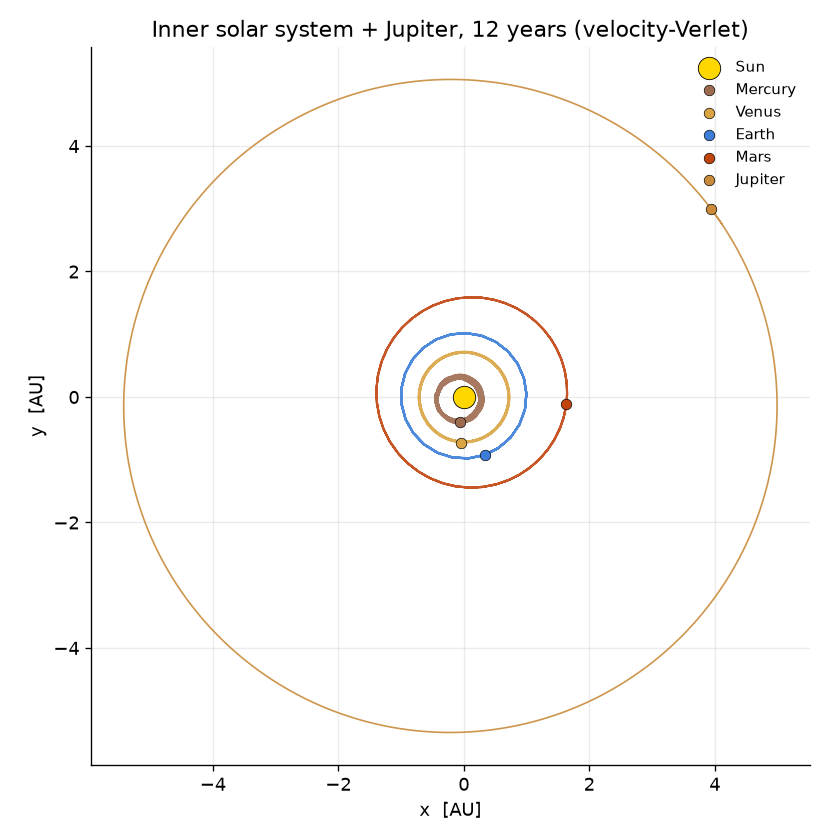
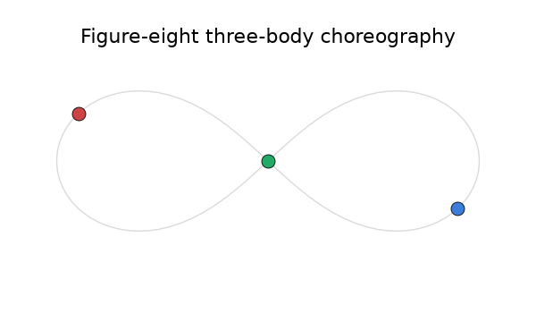
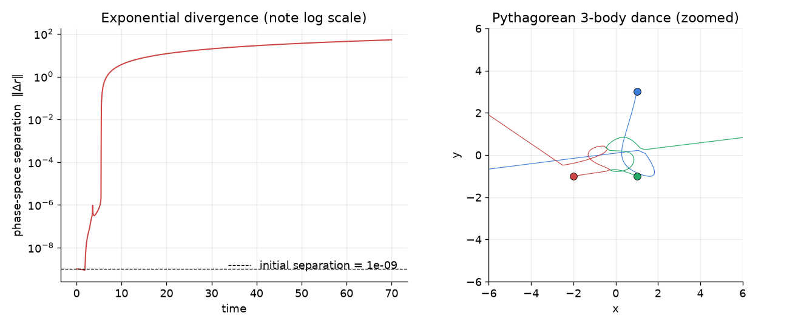
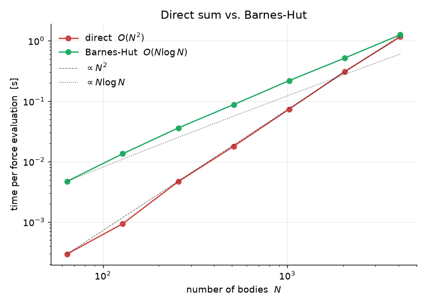
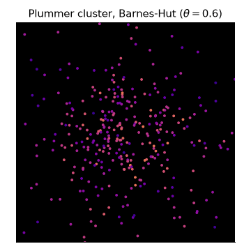
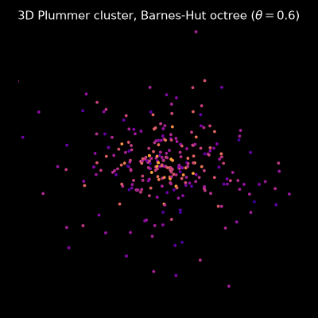

# N-body gravitational simulator

A small N-body code for point masses under Newtonian gravity, written with only
NumPy and Matplotlib. The motion is advanced with a **symplectic
velocity-Verlet** integrator, and every physics claim in this README is backed
by a test in `tests/` — not just a "the code runs" smoke test, but checks on
conserved quantities, orbit shapes, and scaling laws.

The point of the project is correctness you can verify, so the most important
plot is this one:



The same eccentric two-body orbit is integrated for 3000 orbits with a coarse
timestep. The symplectic integrator's energy error stays in a bounded band
forever; the (higher-order, non-symplectic) RK4 quietly bleeds ~18% of the
system's energy over the same run. That bounded-vs-drifting behaviour is the
whole reason to use a symplectic method for gravity, and it is the first thing
the test suite checks.

## Methods

**Gravity.** Each body feels

$$\mathbf{a}_i = G \sum_{j \neq i} m_j \frac{\mathbf{r}_j - \mathbf{r}_i}{\left(\lVert \mathbf{r}_j - \mathbf{r}_i \rVert^2 + \varepsilon^2\right)^{3/2}}.$$

The $\varepsilon$ is *Plummer softening*: it caps the force during close
encounters so a near-collision doesn't blow up the step. With $\varepsilon = 0$
this is the exact point-mass law, which is what the Kepler tests use. The force
is computed as a vectorised $O(N^2)$ sum (`nbody/forces.py`).

**Integrator.** Velocity-Verlet, in kick-drift-kick form:

$$\mathbf{v}_{1/2} = \mathbf{v}_0 + \tfrac{1}{2}\,\Delta t\, \mathbf{a}_0,\qquad
\mathbf{x}_1 = \mathbf{x}_0 + \Delta t\, \mathbf{v}_{1/2},\qquad
\mathbf{v}_1 = \mathbf{v}_{1/2} + \tfrac{1}{2}\,\Delta t\, \mathbf{a}_1.$$

It is second-order, time-reversible, and symplectic, so it conserves a slightly
perturbed ("shadow") Hamiltonian exactly — which is why the energy error
oscillates within a fixed band instead of drifting. A standard RK4 is included
in the same module purely as a foil for the comparison above.

Why velocity-Verlet rather than something fancier? For Hamiltonian systems the
long-term *qualitative* behaviour (bounded energy, no spurious orbital decay)
matters far more than the local truncation order, and a cheap symplectic scheme
beats an expensive non-symplectic one on exactly the runs you care about. It is
also the integrator used by most production N-body and molecular-dynamics codes
for the same reason.

## What's validated

Everything below has a corresponding test; `pytest` runs them all in ~15 s.

### Two-body Kepler orbit

A two-body orbit must trace a *closed* ellipse with the focus at the centre of
mass, and conserve energy and angular momentum. Rather than eyeballing a plot,
the test checks the **Laplace–Runge–Lenz (eccentricity) vector**, which is
constant only for an exact $1/r^2$ force: its constancy *is* the statement that
the ellipse does not precess. Over 40 orbits the perihelion direction drifts by
< 0.1°, angular momentum is conserved to ~$10^{-10}$, and the relative energy
error stays below $10^{-4}$.

### Kepler's third law

Measuring the period for a range of semi-major axes recovers
$T^2 \propto a^3$. The fitted log–log slope is 1.5000, and $T^2/a^3$ is constant
to better than 0.01% across the orbits, matching $4\pi^2/\mu$.



### A multi-body "solar system"

The Sun plus the inner planets and Jupiter (AU / year / solar-mass units, so
$G = 4\pi^2$), integrated for 12 years. The orbits close on themselves and the
total energy is conserved to ~$2\times10^{-6}$.



### The figure-eight three-body choreography

The Chenciner–Montgomery figure-eight: three equal masses chasing each other
around a single curve. The test confirms the orbit is genuinely periodic (it
returns to its initial state after one period to ~$10^{-5}$), that all three
bodies follow the *same* curve phase-shifted by $T/3$, and that momentum and
energy are conserved.



### Sensitivity to initial conditions

The general three-body problem is chaotic. Two copies of the Pythagorean
(Burrau) problem started $10^{-9}$ apart diverge to order-unity separation —
here by a factor of ~$5\times10^{10}$ — before one body is ejected. The growth
is exponential (note the log axis).



### Barnes–Hut tree (O(N log N))

For large $N$ the direct $O(N^2)$ sum is the bottleneck. `nbody/barnes_hut.py`
implements a tree-code Barnes–Hut solver — a quadtree in 2D, an octree in 3D —
where distant groups of bodies are replaced by their centre of mass when the
cell subtends an angle below $\theta$. With $\theta = 0$ it reproduces the
direct sum to machine precision (in both 2D and 3D); at a typical $\theta = 0.5$
the per-body force error is ~1%, and the cost scales as $O(N\log N)$, overtaking
the direct sum a couple of thousand bodies in. (The constant factor is larger in
pure Python than a compiled code, so the 2D crossover sits around $N \approx
2500$; the 3D octree carries more overhead per node.)



A Plummer-sphere star cluster of a few hundred bodies, evolved entirely with the
tree code — in 2D, and as a 3D octree:




## Install

```bash
git clone https://github.com/wei-chen-7/orbital-mechanics.git
cd orbital-mechanics
pip install -r requirements.txt        # numpy, matplotlib, pillow, pytest
# or: pip install -e ".[dev]"
```

## Usage

```python
from nbody import initial_conditions as ic, simulate, diagnostics as diag

# An eccentric two-body orbit.
system = ic.two_body(m1=1.0, m2=1.0, a=1.0, e=0.5)
traj = simulate(system, dt=1e-3, n_steps=20_000, method="verlet")

print(traj.energy_error().max())          # bounded, ~1e-5
print(diag.measure_period(traj))          # matches 2*pi*sqrt(a**3/mu)
```

Swap in the Barnes–Hut evaluator for large systems:

```python
from nbody.barnes_hut import barnes_hut_accelerations

cluster = ic.plummer_sphere(n=1000)
traj = simulate(cluster, dt=2e-3, n_steps=500,
                acc_func=barnes_hut_accelerations(theta=0.5))
```

## Reproducing the figures

Each script writes into `figures/`:

```bash
python examples/energy_comparison.py      # Verlet vs RK4 energy drift
python examples/kepler_third_law.py       # T^2 vs a^3
python examples/solar_system.py           # multi-body orbit plot
python examples/figure_eight.py           # choreography + animation
python examples/three_body_sensitivity.py # chaos / Lyapunov-style divergence
python examples/barnes_hut_cluster.py     # 2D cluster animation + scaling plot
python examples/octree_3d.py              # 3D octree cluster animation
```

## Tests

```bash
pytest
```

The suite checks the force law (direction, magnitude, Newton's third law,
softening, inverse-square fall-off, potential energy), the conserved quantities,
Kepler orbits and the third law, integrator properties (symplectic boundedness
vs RK4 drift, second-order convergence, time-reversibility), the figure-eight
choreography, and Barnes–Hut accuracy against the direct sum.

## Project layout

```
nbody/
  forces.py             direct O(N^2) accelerations + potential energy
  system.py             System container; energy / momentum / angular momentum
  integrators.py        velocity-Verlet, RK4, simulate(), Trajectory
  diagnostics.py        orbital elements, eccentricity vector, period
  initial_conditions.py two-body, solar system, figure-eight, Plummer, ...
  barnes_hut.py         Barnes-Hut force evaluation (2D quadtree / 3D octree)
tests/                  pytest suite (physics, not smoke tests)
examples/               figure-generating demo scripts
figures/                generated figures
```

## Scope and limitations

This is a learning/portfolio project, not a research code. Notable limitations:

- Both the direct solver and the Barnes–Hut tree work in 2D and 3D. The tree is
  a pure-Python implementation, so its constant factor is large; it is meant to
  demonstrate the $O(N\log N)$ scaling, not to compete with a compiled code.
- The integrator uses a fixed timestep. Symplectic integrators and naive
  adaptive timestepping don't mix (varying $\Delta t$ breaks the conservation
  property), so adaptivity is deliberately omitted.
- No relativistic or non-gravitational physics; no collisions or mergers.
- Performance is "fast enough for a few thousand bodies in pure Python," not
  competitive with compiled tree/PM codes.

## References

- L. Verlet, *Computer Experiments on Classical Fluids* (1967) — the integrator.
- J. Barnes & P. Hut, *A hierarchical O(N log N) force-calculation algorithm*,
  Nature (1986).
- A. Chenciner & R. Montgomery, *A remarkable periodic solution of the
  three-body problem in the case of equal masses*, Ann. Math. (2000) — the
  figure-eight.
- E. Hairer, C. Lubich & G. Wanner, *Geometric Numerical Integration* (2006) —
  why symplectic integrators conserve energy over long runs.

## License

MIT — see [LICENSE](LICENSE).
