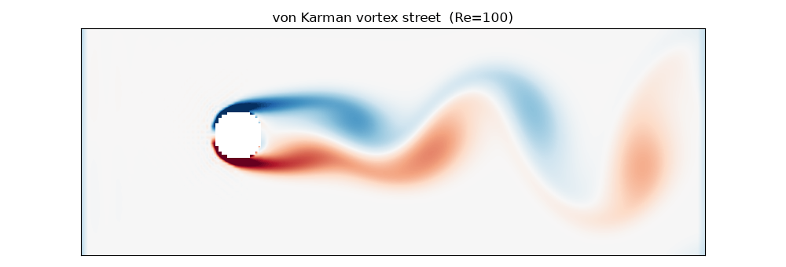
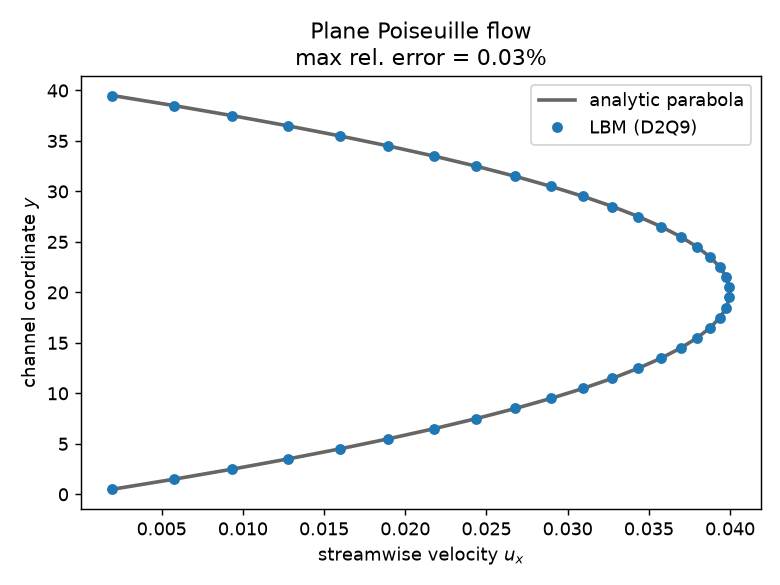
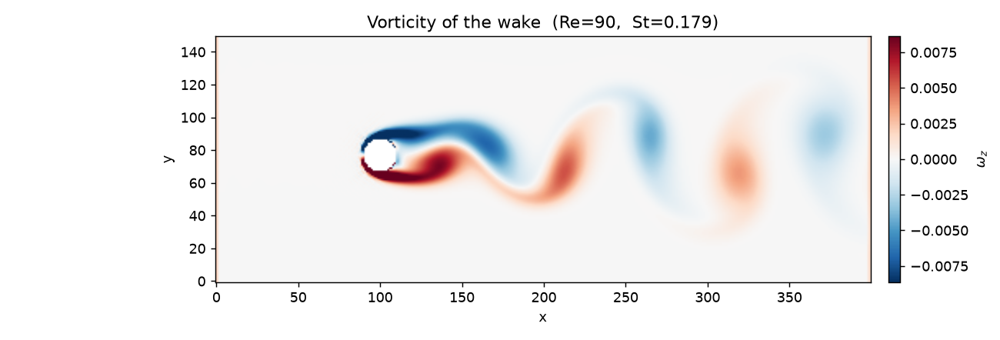
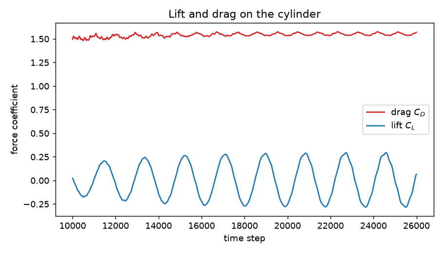

# Lattice Boltzmann fluid simulator (D2Q9, BGK)

A small, readable 2-D fluid solver built on the **Lattice Boltzmann method**
in NumPy. The headline demo is uniform flow past a circular cylinder, which —
above a critical Reynolds number — sheds a **von Kármán vortex street**:



The core is plain NumPy (Matplotlib only for the figures). Collision and
streaming are fully vectorised — there are no per-cell Python loops in the hot
path — and the physics is checked by a `pytest` suite that runs in CI.

This is a learning / portfolio project, not a production CFD code. It implements
the simplest useful flavour of LBM (single-relaxation-time BGK on the D2Q9
lattice). It is accurate in the low-Mach, moderate-Reynolds regime it is built
for, and the [Limitations](#limitations) section is honest about where it stops.

---

## What is the Lattice Boltzmann method?

Instead of discretising the Navier–Stokes equations directly, LBM evolves a set
of **particle distribution functions** `f_i(x, t)` — the density of fictitious
particles at lattice node `x` moving with one of a small set of discrete
velocities `c_i`. The macroscopic density and velocity are recovered as moments
of the distributions:

```
rho   = sum_i f_i                 (mass)
rho u = sum_i c_i f_i             (momentum)
```

Each time step is a **stream-and-collide** cycle:

1. **Collide** — relax the populations towards a local Maxwell–Boltzmann
   equilibrium `f_i^eq`. With the BGK (single-relaxation-time) approximation:

   ```
   f_i*(x, t) = f_i(x, t) - (1/tau) [ f_i(x, t) - f_i^eq(x, t) ]
   ```

   The relaxation time `tau` fixes the kinematic viscosity, `nu = c_s^2 (tau - 1/2)`.

2. **Stream** — move each population to the neighbouring node along its
   velocity:

   ```
   f_i(x + c_i, t + 1) = f_i*(x, t)
   ```

A Chapman–Enskog expansion shows this recovers the incompressible Navier–Stokes
equations in the limit of small Mach and Knudsen number. The equilibrium used
here is the standard second-order truncation:

```
f_i^eq = w_i rho [ 1 + 3 (c_i·u) + 9/2 (c_i·u)^2 - 3/2 (u·u) ]
```

### The D2Q9 lattice

"D2Q9" means **2 dimensions, 9 discrete velocities**: a rest velocity plus eight
pointing to the nearest and next-nearest neighbours on a square lattice.

```
   6   2   5        NW   N   NE        weights:  w_0       = 4/9   (rest)
     \ | /                            w_{1..4}  = 1/9   (axial)
   3 - 0 - 1        W  rest  E         w_{5..8}  = 1/36  (diagonal)
     / | \
   7   4   8        SW   S   SE        lattice speed of sound:  c_s^2 = 1/3
```

The weights are chosen so the lattice is isotropic enough to reproduce the
Navier–Stokes stress tensor; these moment relations are checked directly in
`tests/test_lattice.py`.

### Boundary conditions

- **No-slip walls / obstacle** — halfway *bounce-back*: populations that would
  stream into a solid node are reflected, placing the wall half a lattice
  spacing outside the last fluid node. Used for both the channel walls and the
  immersed cylinder.
- **Inlet** — a Zou/He velocity boundary that prescribes the inflow velocity and
  reconstructs the unknown incoming populations.
- **Outlet** — a zero-gradient (Neumann) outflow on the right wall.
- **Body force** — plane Poiseuille flow is driven by a constant body force,
  applied with the second-order **Guo forcing** scheme.

---

## Results

### 1. Plane Poiseuille flow — validation against theory

A constant body force drives flow through a no-slip channel. In steady state the
streamwise velocity must match the analytic parabola
`u(y) = F y (H - y) / (2 rho nu)`. The simulation reproduces it to well under a
percent:



```
max relative error vs analytic profile  <  0.1 %
```

(`examples/poiseuille.py`; the same check, on a tiny grid, is asserted in
`tests/test_poiseuille.py`.)

### 2. Conservation

With periodic boundaries and no forcing, the scheme conserves total mass and
total momentum to round-off (drift `< 1e-12` over hundreds of steps). See
`tests/test_conservation.py`.

### 3. Flow past a cylinder — the von Kármán vortex street

At a Reynolds number `Re = U D / nu` in the shedding regime, the wake becomes
unstable and sheds alternating vortices:



The shedding frequency `f` is measured from the transverse velocity at a probe
downstream of the cylinder (windowed FFT with sub-bin peak interpolation) and
reported as the dimensionless **Strouhal number** `St = f D / U`:

```
Reynolds number      Re = 90
Strouhal number      St = 0.179      (experimental cylinder wake: ~0.15-0.18)
mean drag            Cd = 1.54       (textbook ~1.4 at this Re)
```

which sits in the expected band for a cylinder wake — at the upper end, since
the finite channel width (here `D/H ≈ 0.13`) mildly confines the flow and nudges
`St` up. (`examples/vortex_street.py`; run with `--quick` for a faster preview.)

### 4. Lift and drag (stretch)

The force on the cylinder is computed by the **momentum-exchange method** from
the post-collision populations, validated against a control-volume momentum
balance (agreement to ~0.2 %; `Cd ≈ 2.5` for steady flow at `Re = 20`). During
shedding the lift coefficient oscillates at the shedding frequency (amplitude
`Cl ≈ 0.29` here) while the drag oscillates about its mean at *twice* that
frequency — the classic signature of alternating vortices:



---

## Installation

```bash
git clone https://github.com/wei-chen-7/orbital-mechanics.git
cd orbital-mechanics
pip install -r requirements.txt      # numpy, matplotlib, pillow, pytest
# or:  pip install -e .
```

Python 3.9+.

## Running the examples

```bash
python examples/poiseuille.py                 # validation figure
python examples/vortex_street.py              # full showcase (a few minutes)
python examples/vortex_street.py --quick      # smaller grid, faster preview
```

Figures and the animation are written to `figures/`.

### Minimal usage

```python
import numpy as np
from lbm import LatticeBoltzmann, cylinder_mask, vorticity

nx, ny, D, U, Re = 400, 150, 20.0, 0.06, 90.0
nu = U * D / Re
tau = 3 * nu + 0.5

solid = cylinder_mask(nx, ny, nx // 4, ny // 2, D / 2)
sim = LatticeBoltzmann(nx, ny, tau, solid=solid, inlet_velocity=(U, 0.0))

for _ in range(20000):
    sim.step()

rho, u = sim.macroscopic()
omega_z = vorticity(u, solid=solid)        # ready to imshow
drag, lift = sim.force_on_solid            # momentum-exchange force
```

---

## Project structure

```
lbm/
  lattice.py     D2Q9 velocities, weights, equilibrium distribution
  solver.py      LatticeBoltzmann: collision, streaming, boundary conditions
  utils.py       geometry masks, vorticity, Strouhal & force diagnostics
tests/           pytest physics checks (Poiseuille, conservation, lattice, forces)
examples/        poiseuille.py, vortex_street.py  -> figures/
figures/         generated figures and the vortex-street animation
```

## Tests & CI

```bash
pytest -q
```

The suite validates the lattice moment relations, mass/momentum conservation,
the Poiseuille profile against theory, and the cylinder drag. GitHub Actions
runs it on every push (`.github/workflows/ci.yml`); the tests use small grids
and short runs to stay fast.

## Limitations

This is deliberately the simplest useful LBM:

- **Single-relaxation-time BGK.** Simple and transparent, but its stability
  degrades as `tau -> 1/2` (high Reynolds / low viscosity). Regularised or
  multiple-relaxation-time (MRT) collisions would push the stable range higher.
- **Weakly compressible.** LBM is an artificial-compressibility method; results
  are only Navier–Stokes-accurate at low Mach number (velocities are kept
  `<< c_s`).
- **Staircased geometry.** The cylinder is a pixelated mask with simple
  bounce-back, so the effective diameter and surface forces carry a small
  geometric error. Interpolated bounce-back would improve this.
- **2-D only**, uniform grid, no turbulence model.

## References

- S. Succi, *The Lattice Boltzmann Equation for Fluid Dynamics and Beyond*, 2001.
- T. Krüger et al., *The Lattice Boltzmann Method: Principles and Practice*, 2017.
- Q. Zou & X. He, "On pressure and velocity boundary conditions for the lattice
  Boltzmann BGK model," *Phys. Fluids* **9**, 1591 (1997).
- Z. Guo, C. Zheng & B. Shi, "Discrete lattice effects on the forcing term in
  the lattice Boltzmann method," *Phys. Rev. E* **65**, 046308 (2002).

## License

MIT — see [LICENSE](LICENSE).
